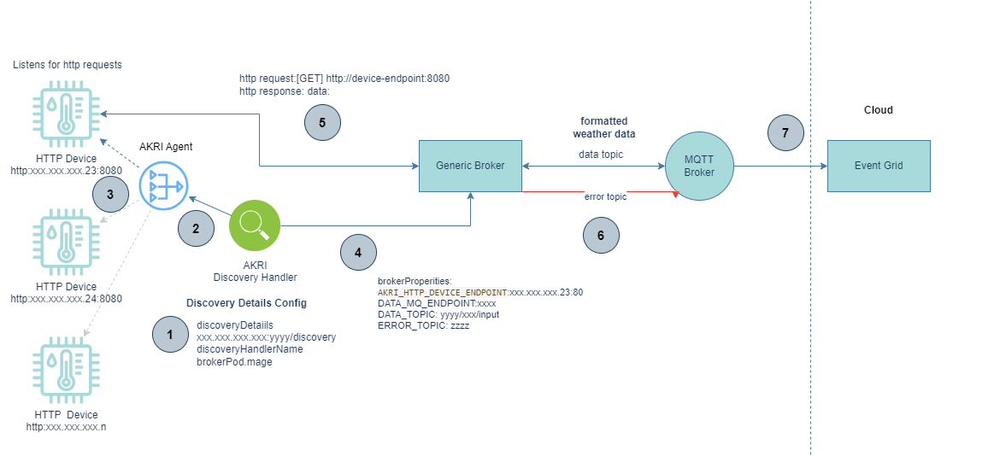

# Custom HTTP Device Discovery Handler in AKRI

## Introduction

This guide outlines the steps to create a custom HTTP device discovery handler in AKRI. AKRI simplifies the process of exposing IoT devices as resources in a Kubernetes cluster. This custom handler will enable the discovery of HTTP-based device sensors.

> [!WARNING]  
> This Azure Edge Extensions has confirmed compatiblity with the 0.5.0 preview version of Azure IoT Operations. Please review
> [AIO release notes](https://github.com/Azure/azure-iot-operations/releases) for current preview version releases.

## Prerequisites

- A Kubernetes cluster
- Helm 3
- AKRI installed on your cluster

## Scenario

### HTTP Device to Broker Scenario

Below is an example of an HTTP device discovery handler and custom broker using Akri. Akri discovers the HTTP-based devices, advertises them as resources, and automatically deploys workloads to utilize those devices. Data from the devices can then be processed or analyzed by the broker or pushed to an MQTT topic for further processing.

<p align="center">
  
</p>

1. Provide discovery handler discovery details in the Broker config.
2. The Discovery handler is provided a list of HTTP device endpoints or sends a request to the HTTP device gateway for a list of devices.
3. The Discovery Handler returns a list of discoverable devices for response.
4. If the request is accepted, deploy a broker pod instance using the defined broker image. (The discovered device endpoint, MQTT publish endpoint(s), and topics are passed in the broker config properties).
5. The broker sends a request to the device endpoint to get data from the device.
6. The broker publishes the data to a topic. If a fail condition occurs, publish to an error topic.
7. Alerts are sent to Azure Event Grid.

## Overview of Creating a Custom Discovery Handler

Creating a custom discovery  handler involves several key steps:

1. **Designing the Discovery Logic**: Determine how your handler will discover devices. This involves defining the criteria and method for identifying available HTTP-based devices in your network.

2. **Implementing the Discovery Handler**: Write the code for your discovery handler, adhering to AKRI's discovery handler interface. This code will be responsible for scanning the network based on your defined logic and reporting discovered devices back to AKRI.

3. **Containerizing the Discovery Handler**: Package your discovery handler as a Docker container. This involves creating a Dockerfile that specifies the base image, dependencies, and the command to run your handler.

4. **Deploying the Discovery Handler**: Deploy your containerized discovery handler to your Kubernetes cluster. This step involves creating Kubernetes manifests for your handler and applying them to your cluster.

5. **Configuring AKRI to Use Your Discovery Handler**: Update AKRI's configuration to use your custom discovery handler for device discovery. This involves modifying the AKRI Configuration CRD to specify your handler.

## Discovery Handler Discovery Details Settings

- The HTTP Discovery Handler identifies the characteristics of the HTTP-based devices you want to discover (e.g., specific endpoints, response patterns). The Discovery Handler will be responsible for scanning the network based on your defined logic and reporting discovered devices back to AKRI. It requires a set of DiscoveryURLs to determine if an endpoint is listening and valid. The device endpoint url and a unique device id represents the http device.

#### Discovery Object

|Helm Key|Value|Default|Description
|--------|-----|-------|-----------
|http.configuration.discoveryDetails.devices|array of device objects|[{_device object_}]|An array of device objects used in defining the devices

|Helm Key|Value|Default|Description
|--------|-----|-------|-----------
|http.configuration.discoveryDetails.devices[].discoveryUrls|array of DiscoveryURLs|["http://localhost:4840/"]|Endpoints that are the status URLs to check to see if the device is up
|http.configuration.discoveryDetails.devices[].deviceIds|array of Device Identifiers|["http-device-001"]|A unique identifier for the http device

### Quick Start

1. Download the repo to your local dev machine.

  ```bash
  git clone <repo url>
  ```

2. Prepare environment variables, adapt the following and run in your bash terminal:

  ```bash
  export ACR_NAME="<update this>" # Existing Azure Container registry
  ```

# Build the discovery handler
```bash
cd src/http-discovery-handler
docker build -t http-discovery-handler .
docker login $ACR_NAME.azurecr.io

# Tag and push the image to the ACR
docker tag http-discovery-handler $ACR_NAME.azurecr.io/http-discovery-handler
docker push $ACR_NAME.azurecr.io/http-discovery-handler
```

## Adding a Device

To add an http device, you need to add a new entry under `httpDevices` in the AKRI configuration. Each entry should have the following fields:

- `id`: A unique identifier for the device.
- `endpoint`: The URL where the device can be accessed.

Here's an example of how to add a device:

```yaml
httpDevices:
- id: new-device
  endpoint: "http://new-device:8080/new-device/input"

```

## Removing a Device

To remove a device, simply delete its entry from `httpDevices` in the AKRI configuration.

Check that the http discovery pod is up and in 'Running' status.

```bash
kubectl get pods -A | grep akri
```

## Configuring AKRI to Use the Discovery Handler

- Modify the [AKRI Broker Configuration](broker-config.md) to use your custom discovery handler. This guide provides details on how to specify the name of your device handler and any necessary parameters. In addtion, it allows you to apply the updated AKRI Configuration to your cluster.

## Deploy [Akri](https://docs.akri.sh/) HTTP Broker and Discovery Handler via a script

- `ACR_NAME` needs to be set to your existing Azure Container registry
```bash
export ACR_NAME="<update this>" # Existing Azure Container registry
```
- Build and push the [discovery handler](#build-the-discovery-handler) and broker.
- Execute the deployment script

```bash
   cd infra/scripts
   ./deploy-akri-config.sh
```

## Troubleshooting

- Ensure your discovery handler is correctly implemented and adheres to AKRI's interface.
- Verify that your Docker image is accessible to your Kubernetes cluster.
- Check the logs of your discovery handler pod for any errors during the discovery process.

## Further Resources

- [AKRI Documentation](https://docs.akri.sh/)
- [Design Patterns: Publisher-Subscriber pattern](https://learn.microsoft.com/en-us/azure/architecture/patterns/publisher-subscriber)
- [What is MQTT and How Does it Work](https://www.techtarget.com/iotagenda/definition/MQTT-MQ-Telemetry-Transport)
- [Configure TLS with manual certificate management to secure MQTT communication](https://learn.microsoft.com/en-us/azure/iot-operations/manage-mqtt-connectivity/howto-configure-tls-manual)
- [Detect assets with Azure IoT Akri](https://learn.microsoft.com/en-us/azure/iot-operations/manage-devices-assets/overview-akri)
